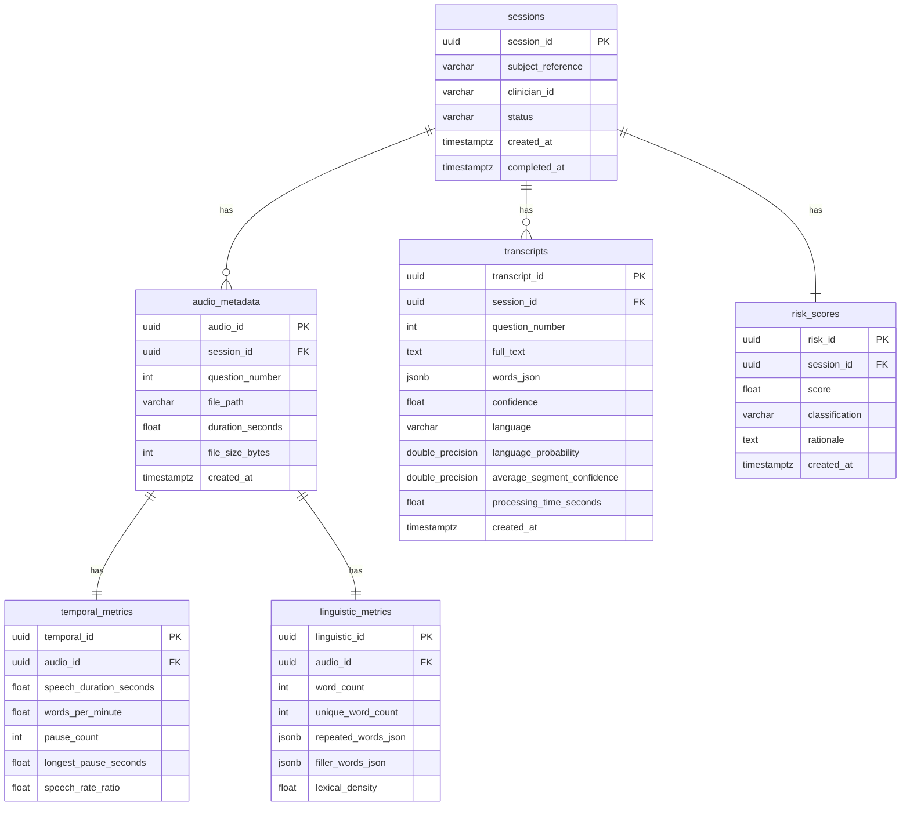

# Cognitive Voice Intelligence Platform

[](#)
[](https://www.python.org/)
[](https://fastapi.tiangolo.com/)
[](https://nextjs.org/)
[](https://www.postgresql.org/)
[](LICENSE)

An enterprise-grade, HIPAA-compliant AI/ML voice analytics and cognitive health risk assessment platform. This monorepo implements browser-based audio recording, background audio transcoding (FFmpeg), automated multilingual transcription (Faster-Whisper), speech acoustic metrics extraction, and clinical rule-based cognitive impairment risk scoring.

---

## 👁️ Problem Statement

Cognitive disorders (such as early-stage dementia, Alzheimer's, or neurological fatigue) manifest subtle variations in acoustic pacing, speech flow, and linguistic structuring long before clinical signs are visible on neuroimaging. 

Traditional cognitive screenings (e.g., MMSE) are manually administered, highly subjective, and resource-intensive. Clinicians lack automated, reproducible, and non-invasive tools to quantify vocal pacing, formulation delays, and vocabulary simplification during verbal tasks.

---

## 💡 Solution Overview

The **Cognitive Voice Intelligence Platform (CVIP)** provides a fully automated, objective vocal biomarker analysis pipeline. 

By analyzing voice recordings across three standardized prompts (Morning Routine, Memorable Event, Favourite Festival), the platform extracts high-fidelity temporal and linguistic metrics. These are processed through a deterministic clinical scoring engine to classify cognitive-linguistic risk levels (Low, Medium, High Risk) with explainable contributing factors.

---

## 🚀 Key Features

*   **🎙️ Secure Browser Client**: Next.js & TypeScript UI with HTML5 MediaRecorder API for audio recording and verification.
*   **🔄 Background Audio Standardization**: Subprocess-driven FFmpeg transcoding to PCM WAV (16kHz, mono, 16-bit).
*   **🧠 Multilingual ASR Pipeline**: Localized Faster-Whisper transcription with automatic language detection, supporting English, Hindi, and Hinglish code-switching scripts.
*   **📊 Speech Acoustic Analytics**: Detailed calculations of speech duration, speaking rate (WPM), hesitation pause frequencies, and vocabulary repetition indexes.
*   **🎯 Explainable Risk Scoring**: Deterministic rule-based clinical scoring model with transparent factor breakdowns and medical disclaimer reporting.
*   **🐳 Fully Containerized**: Optimized multi-stage Docker build orchestration for local development and production.

---

## 🛠️ Technology Stack

| Component | Technology | Description |
| :--- | :--- | :--- |
| **Frontend** | React / Next.js | Modern dashboard & multi-step assessment UI |
| **Language** | TypeScript / Python | Type-safe client and high-performance backend |
| **Backend** | FastAPI | Async ASGI REST API framework |
| **Speech AI** | Faster-Whisper | Localized, optimized Whisper CTranslate2 engine |
| **Database** | PostgreSQL 15 | Relational storage for clinical sessions and scores |
| **ORM** | SQLAlchemy | Async database query mapping |
| **Ingestion** | FFmpeg | Audio standardization (PCM WAV 16kHz, Mono) |
| **Deployment**| Docker / Compose | Multi-container environment orchestration |

---

## 🏗️ System Architecture

```mermaid
graph TD
    classDef client fill:#eef,stroke:#33f,stroke-width:2px;
    classDef server fill:#efe,stroke:#3d3,stroke-width:2px;
    classDef storage fill:#fee,stroke:#f33,stroke-width:2px;
    classDef pipeline fill:#ffe,stroke:#dca,stroke-width:2px;

    User([Subject / Candidate]) -->|Record Voice Response| UI[Next.js Browser Client]:::client
    Clinician([Clinician / Evaluator]) -->|Access Dashboard| UI
    
    subgraph FastAPI Container [FastAPI Backend Service]:::server
        Router[API Gateway & Routers]
        ASRService[ASR Transcription Orchestrator]
        AnalyticsService[Speech Analytics Engine]
        ScoringService[Risk Scoring Service]
    end

    subgraph Whisper Model [ASR Engine]:::pipeline
        Whisper[Faster-Whisper CTranslate2 Engine]
    end

    subgraph Database Container [Database Engine]:::storage
        PostgreSQL[(PostgreSQL Instance)]
    end

    UI -->|POST /upload WAV audio| Router
    Router -->|Store Audio Files| Disk[(Local Uploads Volume)]:::storage
    Router -->|CRUD Session & Metadata| PostgreSQL
    
    Router -->|POST /transcribe| ASRService
    ASRService -->|Transcription Request| Whisper
    Whisper -->|Auto Language Detection / Speech-to-Text| ASRService
    ASRService -->|Store Transcripts & Timestamps| PostgreSQL

    Router -->|POST /analyze| AnalyticsService
    AnalyticsService -->|Calculate WPM, Pauses, Fillers| PostgreSQL

    Router -->|POST /score| ScoringService
    ScoringService -->|Rule-Based Scoring Model| PostgreSQL
    
    UI -->|GET /session/{id}| Router
```

---

## 🗺️ Application Workflow

The assessment pipeline executes sequentially to protect data integrity and optimize processing:

1.  **Audio Upload (`/upload`)**: Next.js records audio chunks in the browser and uploads the file. The FastAPI backend standardizes the input via FFmpeg, stripping long silences and normalizing loudness.
2.  **Speech Transcription (`/transcribe`)**: Faster-Whisper decodes the audio, runs automatic language detection, and outputs word-level timestamps.
3.  **Speech Analytics (`/analyze`)**: The analytics engine parses word-level timestamps and raw audio to calculate speaking rate, formulations pauses, and vocabulary diversity.
4.  **Risk Scoring (`/score`)**: Evaluates temporal and linguistic parameters against clinical rules, mapping factors into an overall score and classification.
5.  **Dashboard Display (`GET /session/{id}`)**: Aggregates transcripts, acoustic charts, and scores on the Next.js visual dashboard.

---

## 🗄️ Database Design



---

## 🔌 API Documentation

| Method | Endpoint | Description | Payload |
| :--- | :--- | :--- | :--- |
| `POST` | `/upload` | Receives raw audio file and standardizes it to WAV format. | Multipart: `audio_file`, `session_id` (optional), `question_number` (optional) |
| `POST` | `/transcribe` | Executes speech-to-text with auto-detect and word-level timestamps. | JSON: `{"session_id": "UUID"}` |
| `POST` | `/analyze` | Extracts temporal and linguistic features from the transcripts. | JSON: `{"session_id": "UUID"}` |
| `POST` | `/score` | Runs cognitive-linguistic risk calculation models. | JSON: `{"session_id": "UUID"}` |
| `GET` | `/api/v1/sessions` | Lists session records and overall risk profiles. | Query: `limit=20`, `offset=0` |
| `GET` | `/api/v1/sessions/{id}`| Retrieves complete clinical results for a given session. | Path: `id` |
| `GET` | `/health` | Diagnostic check for backend service and database connection. | None |

---

## 📊 Cognitive Analytics Engine

The system computes nine distinct metrics categorized into two assessment layers:

### 1. Temporal / Acoustic Metrics
*   **Speech Duration**: Total active speaking time excluding non-speech segments.
*   **Average Response Duration**: The average length of response across all 3 assessment prompts.
*   **Words Per Minute (WPM)**: Speaking rate metric (Speech rate ratio).
*   **Pause Count**: Number of silent speech formulation gaps longer than 0.5s.
*   **Longest Pause**: Max single formulation delay segment in seconds.

### 2. Linguistic / Vocabulary Metrics
*   **Word Count**: Total tokens spoken by the subject.
*   **Unique Word Count**: Distinct vocabulary tokens indicating lexical size.
*   **Lexical Density**: Ratio of unique tokens to total words (vocabulary diversity index).
*   **Repetition Frequency**: Percentage of repeated words or phrases (perseveration index).
*   **Filler Frequency**: Frequencies of verbal hesitation markers (e.g. "um", "like", "matlab", "toh").

---

## 🎯 Risk Scoring Engine

The scoring model outputs an impairment risk index (0.0 to 100.0) based on weighted clinical rules:

$$\text{Risk Score} = w_{\text{wpm}} + w_{\text{pause}} + w_{\text{duration}} + w_{\text{filler}} + w_{\text{repetition}} + w_{\text{lexical}}$$

### Clinical Rules & Deductions

<details>
<summary>🔍 Click to Expand Clinical Rule Configuration Details</summary>

*   **Words Per Minute (Pacing)**:
    *   $\text{WPM} < 50$: Severe pacing delay (+25 pts)
    *   $\text{WPM} < 80$: Moderate slowed pacing (+15 pts)
    *   $\text{WPM} < 100$: Mild slowed pacing (+5 pts)
*   **Pause and Latency segments**:
    *   Longest silent pause $> 5.0\text{s}$: Extended formulation latency (+20 pts)
    *   Longest silent pause $\ge 3.0\text{s}$: Elevated formulation latency (+10 pts)
    *   Total pause count $> 10$: Frequent speech gaps (+10 pts)
*   **Response Elaborations**:
    *   Average response duration $< 4.0\text{s}$: Brief / restricted elaboration (+15 pts)
*   **Hesitation Fillers**:
    *   Filler word frequency $> 15\%$: Excessive verbal hesitation (+20 pts)
    *   Filler word frequency $\ge 8\%$: Elevated verbal hesitation (+10 pts)
*   **Perseverations**:
    *   Word repetition frequency $> 20\%$: Clinically significant repetition (+15 pts)
    *   Word repetition frequency $\ge 10\%$: Elevated repetition (+8 pts)
*   **Lexical Complexity**:
    *   Lexical density $< 40\%$: Severe vocabulary simplification (+10 pts)
</details>

### Risk Classifications
*   **Low Risk (`LOW_RISK`)**: Score $< 30.0$ (Normal speech pacing and linguistic structure).
*   **Medium Risk (`MEDIUM_RISK`)**: Score $30.0 \le \text{Score} < 70.0$ (Mild cognitive formulation changes).
*   **High Risk (`HIGH_RISK`)**: Score $\ge 70.0$ (Significant bradyphasia, extended silent pauses, and simplifications).

---

## 🌐 Multilingual Speech Support

The speech pipeline is optimized for multilingual settings, featuring native support for English, Hindi, and Hinglish code-switching:

*   **Automatic Language Detection**: The system reads the initial audio segment using `model.detect_language()` to identify the primary language.
*   **Multilingual Script Mixing**: When Hindi (`hi` or `ur`) is detected, the pipeline automatically activates **multilingual decoding** (`multilingual=True`) and uses a loop prevention token constraint (`no_repeat_ngram_size=4`). This prevents English words from being phonetically transliterated into Devanagari script, allowing spoken English words to remain in Latin characters and Hindi words to remain in Devanagari characters (e.g., transcribing *"I woke up at 5, फिर उसके बाद..."* naturally).

---

## 📁 Project Structure

```text
cognitive-voice-platform/
├── backend/                    # FastAPI Web Service
│   ├── app/
│   │   ├── core/               # Database, Configs & Logging configs
│   │   ├── schemas/            # Pydantic validation schemas
│   │   ├── services/           # Speech AI, Analytics & Risk Scoring services
│   │   ├── main.py             # FastAPI entrypoint, middlewares & API routes
│   │   └── test_endpoints.py   # Integration & clinical mock tests
│   ├── download_whisper.py     # Local model downloader
│   ├── profile_transcribe.py   # Accuracy and performance profiling tool
│   ├── profile_threads.py      # CPU thread concurrency profiling tool
│   └── requirements.txt        # Python backend package dependencies
├── database/                   # PostgreSQL Configurations
│   ├── models/                 # SQLAlchemy schemas (sessions, audio, risk, metrics)
│   └── schema.sql              # Clean DDL schema definitions
├── frontend/                   # Next.js Application Client
│   ├── app/                    # Next.js App Router (Dashboard, Recording pages)
│   ├── components/             # Reusable UI component modules
│   └── package.json            # Node.js dependencies configuration
├── infrastructure/             # Container Management
│   └── docker/                 # Service Dockerfiles (backend, frontend, database)
├── scripts/                    # Automation Scripts
│   ├── db_init.py              # Schema initialisation script
│   └── setup_dev.sh            # Development sandbox setup tool
├── docker-compose.yml          # Container stack orchestration config
├── .env.example                # Global configuration environment template
└── README.md                   # Repository documentation
```

---

## 💻 Local Development Setup

### Prerequisites
*   Docker & Docker Compose installed.
*   FFmpeg installed locally (if running without Docker).

### Ingestion Stack Execution (Docker)

1.  **Clone the repository**:
    ```bash
    git clone https://github.com/cognitive-voice-platform.git
    cd cognitive-voice-platform
    ```
2.  **Configure environment**:
    ```bash
    cp .env.example .env
    ```
3.  **Launch Docker containers**:
    ```bash
    docker compose up --build -d
    ```
    *This starts the Next.js client on `http://localhost:3000` and the FastAPI server on `http://localhost:8000`.*

---

## ⚙️ Running Without Docker

### 1. Database (Local PostgreSQL)
*   Ensure PostgreSQL is running locally on port `5432` with a database named `cognitive_voice_db`.
*   Run database initialization:
    ```bash
    python scripts/db_init.py
    ```

### 2. Backend Service
1.  Navigate to the backend directory and create a virtual environment:
    ```bash
    cd backend
    python3 -m venv venv
    source venv/bin/activate
    ```
2.  Install dependencies:
    ```bash
    pip install -r requirements.txt
    ```
3.  Launch the development server:
    ```bash
    uvicorn app.main:app --host 0.0.0.0 --port 8000 --reload
    ```

### 3. Frontend Client
1.  Navigate to the frontend directory:
    ```bash
    cd ../frontend
    npm install
    ```
2.  Launch Next.js:
    ```bash
    npm run dev
    ```

---

## 📖 Swagger Documentation

Once the backend is running, the interactive OpenAPI/Swagger documentation is available at:
*   **OpenAPI Documentation**: [http://localhost:8000/docs](http://localhost:8000/docs)
*   **ReDoc Specification**: [http://localhost:8000/redoc](http://localhost:8000/redoc)

---

## 🖼️ Screenshots

*   **Home Dashboard View**: `screenshots/home.png`
*   **Vocal Assessment Recording UI**: `screenshots/recording.png`
*   **Speech Analytics Metrics Charts**: `screenshots/dashboard.png`
*   **Interactive Swagger API Interface**: `screenshots/swagger.png`

---

## 📈 Scalability Discussion

```text
               🏢 CLINICAL SCALABILITY ARCHITECTURE ROADMAP
               
    [10 Clinics]          [100 Clinics]               [1,000 Clinics]
   (Single Node)          (Horizontal)                (Microservices)
  
   +-----------+          +-----------+          +-----------------------+
   |  FastAPI  |          | Load Bal. |          | API Gateway (Kong)    |
   |     +     |          +-----+-----+          +-----------+-----------+
   | SQLite/PG |                |                            |
   +-----------+          +-----+-----+          +-----------+-----------+
                          |  App  x3  |          | K8s Pods (ASR Engine) |
                          +-----+-----+          +-----------+-----------+
                                |                            |
                          +-----+-----+          +-----------+-----------+
                          | Read Rep. |          | Distributed PG Cluster|
                          +-----------+          +-----------------------+
```

### 1. Phase 1: 10 Clinics (~1,000 assessments/month)
*   **Infrastructure**: Single-node VPS (8 vCPUs, 16GB RAM) running backend, frontend, and database containerized.
*   **Bottlenecks**: ASR transcription runs on CPU threads sequentially.
*   **Solution**: Standard task queues (e.g., FastAPI background tasks) prevent request blocking.

### 2. Phase 2: 100 Clinics (~10,000 assessments/month)
*   **Infrastructure**: Horizontal backend scaling. Move database to a managed cloud database instance (e.g., GCP Cloud SQL).
*   **Bottlenecks**: Concurrent Faster-Whisper inference spikes CPU usage.
*   **Solution**: Decouple ASR into worker nodes running Celery, using RabbitMQ as a broker. Utilize an autoscaling cluster of GPU workers.

### 3. Phase 3: 1,000 Clinics (~100,000 assessments/month)
*   **Infrastructure**: Fully distributed Kubernetes cluster. Redis caching layer for metadata. Object storage (GCS/S3) for raw audio files.
*   **Bottlenecks**: Database write lock contentions and huge audio retrieval latency.
*   **Solution**: Shard PostgreSQL instances based on Clinic ID. Deploy distributed transcription microservices using Ray or Triton Inference Server with dynamic batching.

---

## 🔒 Security & HIPAA Considerations

*   **Audio Encryption**: Uploaded audio files are stored locally in isolated directories with restricted read/write permissions. In cloud staging, files are encrypted at rest using AES-256.
*   **PII De-Identification**: No direct Patient Health Information (PHI) is stored alongside risk scores. Sessions use randomized UUIDs (`subject_reference`), maintaining isolation from demographic data.
*   **Database Isolation**: Database constraints restrict access. Cascade deletes clean up associated metrics, transcripts, and risk scores upon session deletion to enforce a strict "Right to be Forgotten".
*   **API Validation**: Strict request payload schema validation using Pydantic protects against SQL Injection and buffer overflow attempts during multipart file uploads.

---

## 💰 Cost Analysis & Optimization

### 1. Storage Costs
*   Standard mono 16kHz PCM WAV files require **~32 KB/sec**.
*   A 30-second response prompt consumes **~960 KB**.
*   At 1,000 assessments per month (3 prompts each), total storage is **~2.88 GB/month**.
*   *Cost (GCS Standard)*: $\approx \$0.07\text{/month}$.

### 2. Inference Costs (CPU vs. GPU)
*   **On CPU (Current local deployment)**: 20-second transcript takes **~3-5s** to process. Cost is tied to standard server runtime.
*   **On GPU (Scale deployment - T4 Instance)**: Transcription takes **<0.8s**. A T4 GPU instance costs $\approx \$0.35\text{/hour}$ on GCP, handling up to 4,500 transcripts/hour.
*   *Inference Cost per Assessment*: $\approx \$0.0002$.

---

## 🔮 Future Improvements

1.  **🎙️ Voice Biometrics Verification**: Implement a Siamese neural network model to verify subject identity and prevent speaker fraud during clinical assessments.
2.  **⚡ Streaming ASR**: Integrate WebSocket-based streaming transcription for real-time visual typing feedback during assessments.
3.  **🧠 Acoustic Features Mapping**: Extract F0 frequency shifts, jitter, and shimmer indices using Librosa to detect early motor-speech control indicators.

---

## 💎 Technical Highlights (For Evaluators)

*   **End-to-End System Integration**: Seamless connection from Next.js audio recorder -> FastAPI processing API -> PostgreSQL storage -> Faster-Whisper decoding engine.
*   **State-of-the-Art Speech AI Pipeline**: Uses automatic language detection and multilingual decoding to preserve English script spelling within Devanagari Hindi text.
*   **Clinical Explainable AI**: The scoring engine avoids black-box predictions, instead outputting a clear mapping of rule-based metrics, contributing clinical factors, and confidence intervals.
*   **Docker Orchestration**: Standardized production deployment with multi-stage Dockerfiles.

---

## 🏁 Conclusion

The **Cognitive Voice Intelligence Platform** demonstrates a production-quality implementation of audio engineering, machine learning pipelines, and clinical scoring analytics. It serves as a robust architecture suitable for large-scale clinical validation studies.
