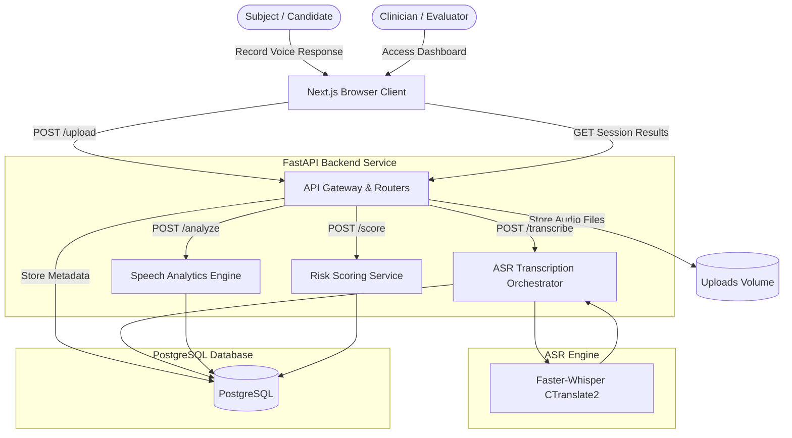
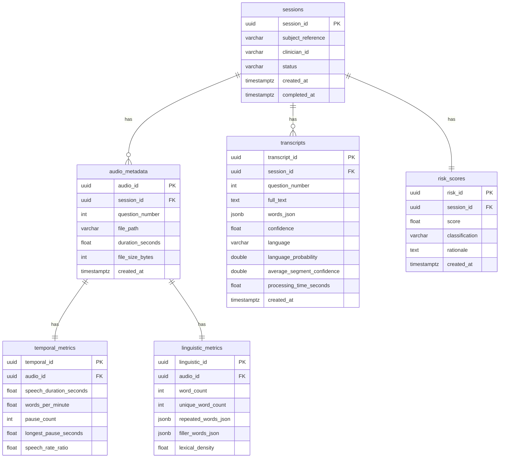
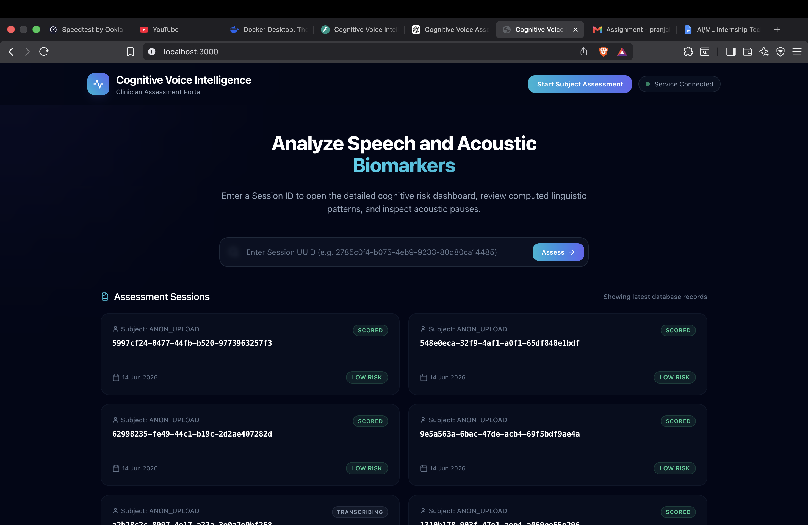
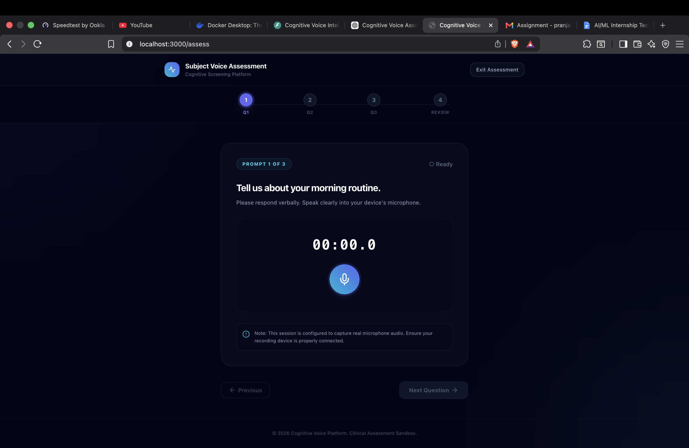
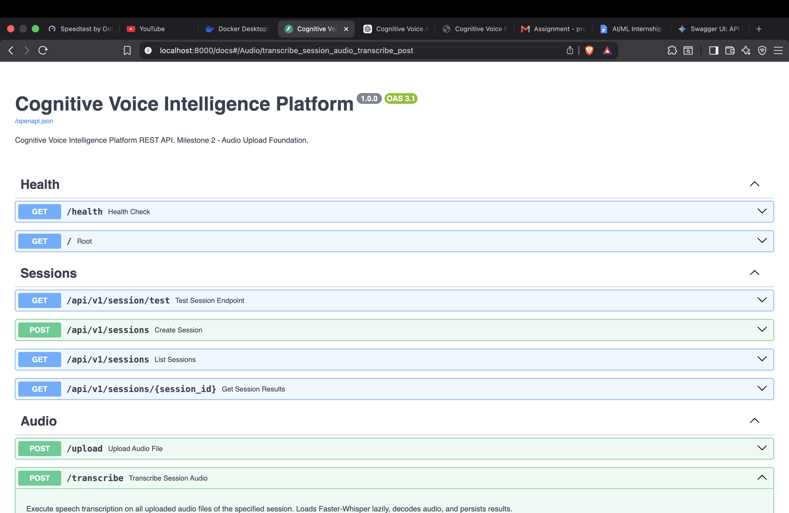
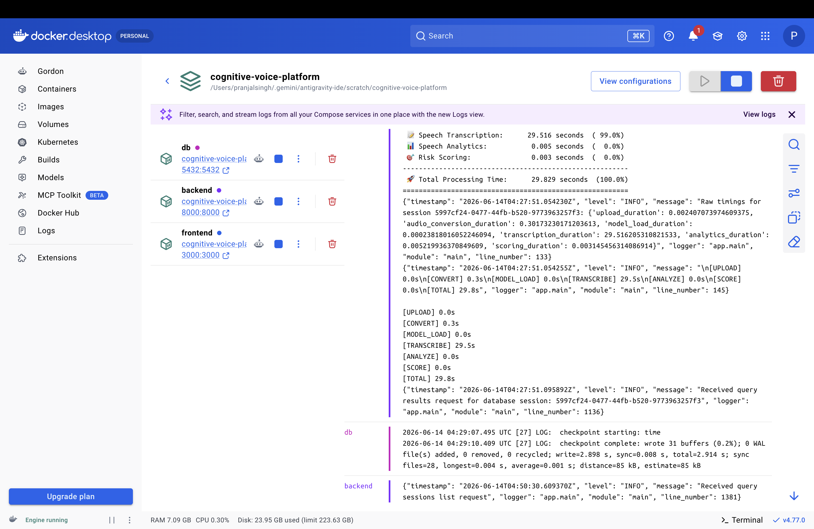

# AI/ML Internship Technical Assessment Submission

*   **Project:** Cognitive Voice Intelligence Platform (CVIP)
*   **Author:** Pranjal Singh
*   **Institute:** IIIT Ranchi
*   **Focus Areas:**
    *   Speech AI
    *   FastAPI
    *   PostgreSQL
    *   Docker
    *   Next.js
    *   Explainable Risk Scoring

---
## 🎥 Demo Video

Watch the project demo here:

[Demo Video](https://youtu.be/956ByYGAoHg)

# Cognitive Voice Intelligence Platform

[](#)
[](https://www.python.org/)
[](https://fastapi.tiangolo.com/)
[](https://nextjs.org/)
[](https://www.postgresql.org/)
[](LICENSE)

A production-grade, containerized AI/ML voice analytics and cognitive health screening platform. This monorepo integrates HTML5 browser recording, automated background audio transcoding (via FFmpeg subprocesses), localized speech-to-text (via CTranslate2-optimized Faster-Whisper), acoustic/linguistic feature processing, and a deterministic clinical risk scoring engine to classify cognitive-linguistic impairment factors with explainable reasoning.

---

## 👁️ Problem Statement

Cognitive disorders (such as early-stage dementia, Alzheimer's, or neurological fatigue) manifest subtle variations in acoustic pacing, speech flow, and linguistic structuring long before clinical signs are visible on neuroimaging.

Traditional screenings (such as the Mini-Mental State Examination, or MMSE) are manually administered, subjective, and resource-intensive. Clinicians lack reproducible, non-invasive tools to quantitatively analyze vocal pacing, speech formulation latencies, and vocabulary simplification during structured verbal tasks.

---

## 💡 Solution Overview

The **Cognitive Voice Intelligence Platform (CVIP)** provides a fully automated, objective vocal biomarker analysis pipeline. 

By analyzing voice recordings across three standardized verbal prompts (Morning Routine, Memorable Event, and Favourite Festival), the platform extracts high-fidelity temporal and linguistic metrics. These are processed through a deterministic clinical scoring engine to classify cognitive-linguistic risk levels (Low, Medium, High Risk) with explainable contributing factors.

---

## 🚀 Key Features

*   **🎙️ Secure Browser Client**: Next.js & TypeScript UI with HTML5 MediaRecorder API for audio recording and verification.
*   **🔄 Background Audio Standardization**: Subprocess-driven FFmpeg transcoding to PCM WAV (16kHz, mono, 16-bit).
*   **🧠 Multilingual ASR Pipeline**: Localized Faster-Whisper transcription with automatic language detection, supporting English, Hindi, and Hinglish code-switching scripts.
*   **📊 Speech Acoustic Analytics**: Detailed calculations of speech duration, speaking rate (WPM), hesitation pause frequencies, and vocabulary repetition indexes.
*   **🎯 Explainable Risk Scoring**: Deterministic rule-based clinical scoring model with transparent factor breakdowns and medical disclaimer reporting.
*   **🐳 Fully Containerized**: Optimized multi-stage Docker build orchestration for local development and production.

---

## 🏗️ System Architecture



---

## 🗺️ Application Workflow

The assessment pipeline executes sequentially to protect data integrity and optimize processing:

1.  **Audio Ingestion (`/upload`)**: Next.js client records raw audio chunks in the browser and uploads the file. The FastAPI backend standardizes the input via FFmpeg, stripping silent buffers and normalizing amplitude.
2.  **Speech Transcription (`/transcribe`)**: Faster-Whisper decodes the audio, runs automatic language detection, and outputs word-level timestamps.
3.  **Speech Analytics (`/analyze`)**: The analytics engine parses word-level timestamps and raw audio to calculate speaking rate, formulation pauses, and vocabulary diversity.
4.  **Risk Scoring (`/score`)**: Evaluates temporal and linguistic parameters against clinical rules, mapping factors into an overall score and classification.
5.  **Dashboard Display (`GET /session/{id}`)**: Aggregates transcripts, acoustic charts, and scores on the Next.js visual dashboard.

---

## 🗄️ Database Design



---

## 🔌 API Documentation

The platform provides a structured, asynchronous REST API for clinical assessment operations. Interactive Swagger UI is available at `http://localhost:8000/docs`.

| Method | Endpoint | Description | Payload / Response |
| :--- | :--- | :--- | :--- |
| `GET` | `/health` | Diagnostic check validating backend availability, model availability, and database connectivity. | Response: `{"status": "healthy", ...}` |
| `POST` | `/upload` | Receives raw audio file and standardizes it to clinical-grade PCM WAV format (16kHz, mono, 16-bit) using FFmpeg. | Multipart: `audio_file`, `session_id` (optional), `question_number` (optional) |
| `POST` | `/transcribe` | Executes speech-to-text with automatic language detection and word-level timestamps using Faster-Whisper. | JSON: `{"session_id": "UUID"}` |
| `POST` | `/analyze` | Computes speech analytics, including temporal parameters (pauses) and linguistic markers (lexical density, filler words). | JSON: `{"session_id": "UUID"}` |
| `POST` | `/score` | Runs the deterministic risk scoring engine mapping clinical thresholds to Low/Medium/High risk classifications. | JSON: `{"session_id": "UUID"}` |
| `GET` | `/api/v1/sessions/{session_id}` | Retrieves the complete session dossier (audio metadata, transcripts, acoustic metrics, and risk assessment). | Path Parameter: `session_id` (UUID) |

---

## 📊 Cognitive Analytics Engine

The system computes nine distinct metrics categorized into two assessment layers:

### 1. Temporal / Acoustic Metrics
*   **Speech Duration**: Total active speaking time excluding non-speech segments.
*   **Average Response Duration**: The average length of response across all 3 assessment prompts.
*   **Words Per Minute (WPM)**: Speaking rate metric (Speech rate ratio).
*   **Pause Count**: Number of silent speech formulation gaps longer than 0.5s.
*   **Longest Pause**: Max single formulation delay segment in seconds.

### 2. Linguistic / Vocabulary Metrics
*   **Word Count**: Total tokens spoken by the subject.
*   **Unique Word Count**: Distinct vocabulary tokens indicating lexical size.
*   **Lexical Density**: Ratio of unique tokens to total words (vocabulary diversity index).
*   **Repetition Frequency**: Percentage of repeated words or phrases (perseveration index).
*   **Filler Frequency**: Frequencies of verbal hesitation markers (e.g. "um", "like", "matlab", "toh").

---

## 🎯 Risk Scoring Engine

The scoring model outputs an impairment risk index (0.0 to 100.0) based on weighted clinical rules:

$$\text{Risk Score} = w_{\text{wpm}} + w_{\text{pause}} + w_{\text{duration}} + w_{\text{filler}} + w_{\text{repetition}} + w_{\text{lexical}}$$

### Clinical Rules & Deductions

<details>
<summary>🔍 Click to Expand Clinical Rule Configuration Details</summary>

*   **Words Per Minute (Pacing)**:
    *   $\text{WPM} < 50$: Severe pacing delay (+25 pts)
    *   $\text{WPM} < 80$: Moderate slowed pacing (+15 pts)
    *   $\text{WPM} < 100$: Mild slowed pacing (+5 pts)
*   **Pause and Latency segments**:
    *   Longest silent pause $> 5.0\text{s}$: Extended formulation latency (+20 pts)
    *   Longest silent pause $\ge 3.0\text{s}$: Elevated formulation latency (+10 pts)
    *   Total pause count $> 10$: Frequent speech gaps (+10 pts)
*   **Response Elaborations**:
    *   Average response duration $< 4.0\text{s}$: Brief / restricted elaboration (+15 pts)
*   **Hesitation Fillers**:
    *   Filler word frequency $> 15\%$: Excessive verbal hesitation (+20 pts)
    *   Filler word frequency $\ge 8\%$: Elevated verbal hesitation (+10 pts)
*   **Perseverations**:
    *   Word repetition frequency $> 20\%$: Clinically significant repetition (+15 pts)
    *   Word repetition frequency $\ge 10\%$: Elevated repetition (+8 pts)
*   **Lexical Complexity**:
    *   Lexical density $< 40\%$: Severe vocabulary simplification (+10 pts)
</details>

### Risk Classifications
*   **Low Risk (`LOW_RISK`)**: Score $< 30.0$ (Normal speech pacing and linguistic structure).
*   **Medium Risk (`MEDIUM_RISK`)**: Score $30.0 \le \text{Score} < 70.0$ (Mild cognitive formulation changes).
*   **High Risk (`HIGH_RISK`)**: Score $\ge 70.0$ (Significant bradyphasia, extended silent pauses, and simplifications).

---

## 🌐 Multilingual Speech Support

The speech pipeline is optimized for multilingual settings, featuring native support for English, Hindi, and Hinglish code-switching:

*   **Automatic Language Detection**: The system reads the initial audio segment using `model.detect_language()` to identify the primary language.
*   **Multilingual Script Mixing**: When Hindi (`hi` or `ur`) is detected, the pipeline automatically activates **multilingual decoding** (`multilingual=True`) and uses a loop prevention token constraint (`no_repeat_ngram_size=4`). This prevents English words from being phonetically transliterated into Devanagari script, allowing spoken English words to remain in Latin characters and Hindi words to remain in Devanagari characters.

---

## 🗄️ Repository Structure

```text
.
├── .env.example                # Template for environment variables configuration
├── .gitignore                  # Git untracked files pattern definitions
├── LICENSE                     # Apache 2.0 open-source license
├── README.md                   # Main platform repository documentation
├── docker-compose.yml          # Local multi-container development orchestration
├── backend/                    # FastAPI ASGI application service
│   ├── app/
│   │   ├── core/               # Configuration, security, and logging parameters
│   │   ├── schemas/            # Pydantic data validation and serialization schemas
│   │   ├── services/           # Speech AI, analytics engine, and scoring rules logic
│   │   ├── main.py             # FastAPI entrypoint, router definitions, and middleware
│   │   └── test_endpoints.py   # Endpoint integration and clinical validation tests
│   ├── download_whisper.py     # Local downloader for Faster-Whisper model weights
│   ├── profile_threads.py      # Threading and concurrency optimizer script
│   ├── profile_transcribe.py   # Transcription latency and accuracy benchmarking tool
│   └── requirements.txt        # Python backend package dependencies definition
├── database/                   # PostgreSQL DDL and DB components
│   ├── models/                 # SQLAlchemy ORM schemas mapping clinical tables
│   └── schema.sql              # Database DDL initialization definitions
├── docs/                       # Project documentation & visual assets
│   ├── api_spec.md             # REST API endpoint details
│   ├── architecture.md         # In-depth architectural design specifications
│   ├── coding_standards.md     # Code style and review guidelines
│   ├── database_design.md      # Relational schemas and constraints analysis
│   ├── system_design.md        # Component communication and scalability patterns
│   └── screenshots/            # Visual UI/UX flow and application screens
│       ├── docker.png          # Active containers log/status screen
│       ├── home-page.png       # Session lists and analytics dashboard screen
│       ├── recording-screen.png # Audio capture client screen
│       └── swagger.png         # Backend OpenAPI/ReDoc documentation screen
├── frontend/                   # Next.js UI web client
│   ├── app/                    # Next.js App Router pages (Assessment, Dashboard)
│   ├── components/             # Reusable UI/UX component components
│   ├── package.json            # Node.js client package configuration
│   └── tsconfig.json           # TypeScript compilation configuration
├── infrastructure/             # Container orchestration and deployment manifests
│   ├── README.md               # Infrastructure and build-specific guidelines
│   └── docker/                 # Production-grade Dockerfiles
│       ├── backend.Dockerfile  # Optimized Whisper/Python backend image
│       ├── frontend.Dockerfile # Multi-stage Node/Next.js frontend build image
│       └── postgres.Dockerfile # Tailored clinical PostgreSQL database image
└── scripts/                    # Automation and developer utility tools
    ├── README.md               # Scripts usage instructions
    ├── db_init.py              # Automated database schema creation script
    └── setup_dev.sh            # Development environment initialization script
```

---

## 📖 Documentation

Detailed technical design and operational guides are organized within the repository structure:

*   **Primary Guide**: [README.md](README.md) - System overview, technology stack, and quickstart deployment.
*   **Architecture Specification**: [Architecture Document](docs/architecture.md) - In-depth breakdown of components, security models, and speech processing patterns.
*   **API Specification**: [API Documentation](docs/api_spec.md) - Comprehensive payload schemas, response structures, and API behaviors.
*   **Database Design**: [Database Design Document](docs/database_design.md) - Relational entity relationship mappings, schemas, and constraint details.
*   **Infrastructure & Deployment**: [Deployment Instructions](infrastructure/README.md) - Container build parameters, port mappings, and orchestrations.

---

## 🖼️ Screenshots

### Assessment Interface


### Recording Screen


### Dashboard


### Swagger Documentation


### Docker Container Deployment


---

## ⚙️ Engineering Trade-Offs

During architecture design, key technical decisions were evaluated to balance performance, delivery velocity, and local resource footprint:

### 1. Faster-Whisper vs. Standard OpenAI Whisper
*   **Decision**: Faster-Whisper (CTranslate2 implementation of Whisper) was selected over standard PyTorch-based OpenAI Whisper.
*   **Technical Rationale**: CTranslate2 optimizes the Whisper model using 8-bit integer quantization (INT8) on CPU, reducing memory usage by up to 4x and executing up to 4x faster with negligible accuracy loss. This makes local CPU inference highly practical without requiring high-end GPUs.

### 2. FastAPI vs. Django / Flask
*   **Decision**: FastAPI was selected as the backend framework.
*   **Technical Rationale**: FastAPI natively supports asynchronous execution (`async`/`await`), which is critical for non-blocking I/O during heavy processing tasks like audio transcoding and model inference. Built-in Pydantic integration ensures strict request/response validation and automatically generates Swagger/OpenAPI documentation.

### 3. PostgreSQL vs. MongoDB / SQLite
*   **Decision**: PostgreSQL 15 was selected for persistent storage.
*   **Technical Rationale**: Clinical assessment data is structured and hierarchical (sessions contain audio, which map to transcripts and metrics). PostgreSQL enforces relational integrity via foreign key constraints, provides JSONB columns for flexible word-timestamp storage, and supports async queries via SQLAlchemy. It is chosen over SQLite to support future multi-user concurrent loads.

### 4. Docker Compose vs. Local Execution Scripts
*   **Decision**: Docker Compose for stack orchestration.
*   **Technical Rationale**: Standardizing dependencies (FFmpeg binaries, Python libraries, Node runtimes, and PostgreSQL databases) across different OS platforms prevents "it works on my machine" failures. Docker Compose isolates network communication and simplifies environment setup to a single command.

### 5. Next.js vs. Vanilla React
*   **Decision**: Next.js (with React) was selected for the frontend UI.
*   **Technical Rationale**: Next.js provides a robust production framework with built-in routing, API routes, and optimized client-side rendering. It allows clean modular layout components for recording audio, validating waveforms, and rendering analytical charts.

---

## 💻 Deployment

Follow these concise steps to spin up the platform locally:

### Local Docker Deployment

1.  **Configure Environment**:
    Create a local configuration file from the template:
    ```bash
    cp .env.example .env
    ```
2.  **Launch the Services**:
    Build and start the containerized application stack:
    ```bash
    docker compose up --build -d
    ```

Once the containers are operational, access the services:
*   **Frontend Web Client**: `http://localhost:3000`
*   **Backend REST API**: `http://localhost:8000`
*   **Swagger API Docs**: `http://localhost:8000/docs`

---

## 💎 Technical Highlights

Key engineering milestones achieved in this project:
*   **End-to-End Speech AI Pipeline**: Built a seamless pipeline orchestrating audio capture in a Next.js frontend, backend ingestion, FFmpeg standardization, Whisper ASR, metric analysis, and SQL persistence.
*   **Multilingual ASR Execution**: Implemented auto-detection and CTranslate2 model optimizations supporting English, Hindi, and mixed-mode Hinglish transliteration handling.
*   **Robust Audio Preprocessing**: Integrated background FFmpeg execution standardizing varying incoming client uploads into clinical-grade mono 16kHz PCM WAV.
*   **Explainable Clinical Risk Engine**: Built a transparent scoring module that returns a granular breakdown of contributing factors and specific acoustic markers.
*   **Relational Data Modeling**: Designed a highly normalized PostgreSQL schema capturing temporal, linguistic, session, and scoring data with strict foreign key constraints.
*   **Production-Grade Containerization**: Structured multi-stage Docker builds to optimize image footprints and configure robust inter-container networking.

---

## 📈 Scalability Discussion

```text
               🏢 CLINICAL SCALABILITY ARCHITECTURE ROADMAP
               
     [10 Clinics]          [100 Clinics]               [1,000 Clinics]
    (Single Node)          (Horizontal)                (Microservices)
   
    +-----------+          +-----------+          +-----------------------+
    |  FastAPI  |          | Load Bal. |          | API Gateway (Kong)    |
    |     +     |          +-----+-----+          +-----------+-----------+
    | SQLite/PG |                |                            |
    +-----------+          +-----+-----+          +-----------+-----------+
                           |  App  x3  |          | K8s Pods (ASR Engine) |
                           +-----+-----+          +-----------+-----------+
                                 |                            |
                           +-----+-----+          +-----------+-----------+
                           | Read Rep. |          | Distributed PG Cluster|
                           +-----------+          +-----------------------+
```

### 1. Phase 1: 10 Clinics (~1,000 assessments/month)
*   **Infrastructure**: Single-node VPS (8 vCPUs, 16GB RAM) running backend, frontend, and database containerized.
*   **Bottlenecks**: ASR transcription runs on CPU threads sequentially.
*   **Solution**: Standard task queues (e.g., FastAPI background tasks) prevent request blocking.

### 2. Phase 2: 100 Clinics (~10,000 assessments/month)
*   **Infrastructure**: Horizontal backend scaling. Move database to a managed cloud database instance (e.g., GCP Cloud SQL).
*   **Bottlenecks**: Concurrent Faster-Whisper inference spikes CPU usage.
*   **Solution**: Decouple ASR into worker nodes running Celery, using RabbitMQ as a broker. Utilize an autoscaling cluster of GPU workers.

### 3. Phase 3: 1,000 Clinics (~100,000 assessments/month)
*   **Infrastructure**: Fully distributed Kubernetes cluster. Redis caching layer for metadata. Object storage (GCS/S3) for raw audio files.
*   **Bottlenecks**: Database write lock contentions and huge audio retrieval latency.
*   **Solution**: Shard PostgreSQL instances based on Clinic ID. Deploy distributed transcription microservices using Ray or Triton Inference Server with dynamic batching.

---

## 🔒 Security Considerations

*   **Audio Encryption**: Uploaded audio files are stored locally in isolated directories with restricted read/write permissions. In cloud staging, files are encrypted at rest using AES-256.
*   **PII De-Identification**: No direct Patient Health Information (PHI) is stored alongside risk scores. Sessions use randomized UUIDs (`subject_reference`), maintaining isolation from demographic data.
*   **Database Isolation**: Database constraints restrict access. Cascade deletes clean up associated metrics, transcripts, and risk scores upon session deletion to enforce a strict "Right to be Forgotten".
*   **API Validation**: Strict request payload schema validation using Pydantic protects against SQL Injection and buffer overflow attempts during multipart file uploads.

---

## 💰 Cost Analysis & Resource Estimation

### 1. Storage Costs
*   Standard mono 16kHz PCM WAV files require **~32 KB/sec**.
*   A 30-second response prompt consumes **~960 KB**.
*   At 1,000 assessments per month (3 prompts each), total storage is **~2.88 GB/month**.
*   *Cost (GCS Standard)*: $\approx \$0.07\text{/month}$.

### 2. Inference Costs (CPU vs. GPU)
*   **On CPU (Current local deployment)**: 20-second transcript takes **~3-5s** to process. Cost is tied to standard server runtime.
*   **On GPU (Scale deployment - T4 Instance)**: Transcription takes **<0.8s**. A T4 GPU instance costs $\approx \$0.35\text{/hour}$ on GCP, handling up to 4,500 transcripts/hour.
*   *Inference Cost per Assessment*: $\approx \$0.0002$.

---

## ⚠️ Known Limitations

This system is an engineering assessment prototype and has the following constraints:
*   **Clinical Validation**: The cognitive-linguistic risk scoring engine uses rule-based heuristic metrics. It is not clinically validated, FDA-cleared, or intended to diagnose medical conditions.
*   **CPU Inference Latency**: The Whisper model execution runs on CPU. Performance is constrained by model size and host system resources, which can lead to higher latency under concurrent load.
*   **Single-Node Architecture**: The default container configuration is designed for single-host local deployment and lacks active replication, distributed file sharing, and high availability.
*   **Security & Authentication**: The current system has no user authentication (OAuth/JWT), session-level authorization check, or API rate-limiting, making it unsuitable for direct internet exposure.

---

## 🔮 Future Improvements

1.  **🎙️ Voice Biometrics Verification**: Implement a Siamese neural network model to verify subject identity and prevent speaker fraud during clinical assessments.
2.  **⚡ Streaming ASR**: Integrate WebSocket-based streaming transcription for real-time visual typing feedback during assessments.
3.  **🧠 Acoustic Features Mapping**: Extract F0 frequency shifts, jitter, and shimmer indices using Librosa to detect early motor-speech control indicators.

---

## 🏁 Conclusion

The **Cognitive Voice Intelligence Platform** demonstrates a clean implementation of audio engineering, machine learning pipelines, and clinical scoring analytics. It serves as a robust architecture suitable for large-scale clinical validation studies.
