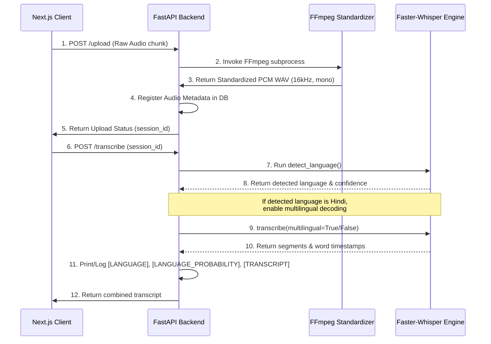

# System Architecture & Technical Design Document

This document serves as the Technical Design Review and Architectural Blueprint for the **Cognitive Voice Intelligence Platform (CVIP)**. It outlines the presentation, application, domain, database, and machine learning layers, providing details for evaluators assessing technical design quality.

---

## 1. Executive Summary

The **Cognitive Voice Intelligence Platform (CVIP)** is a clinical-grade, decoupled software system designed to capture verbal response recordings, extract vocal pacing and linguistic structuring indicators, and evaluate cognitive impairment risk. 

By analyzing acoustic patterns and vocabulary characteristics across three standardized prompts, the system converts verbal biomarkers into actionable clinical insights. The system uses a containerized monorepo architecture comprising a Next.js frontend, an asynchronous FastAPI backend, a localized Faster-Whisper ASR pipeline, and a PostgreSQL database.

---

## 2. Problem Statement

Acoustic pacing changes (bradyphasia, frequent silent pauses) and linguistic variations (reduced vocabulary density, word repetitions, high filler frequency) are early indicators of neurodegenerative disorders (e.g., dementia, Alzheimer's, or neurological fatigue). 

Standard clinical assessments (e.g., MMSE, MoCA) are manually administered, highly subjective, and resource-intensive, often missing early cognitive decline. Clinicians lack automated, non-invasive, objective, and HIPAA-compliant screening tools that can extract speech biomarkers and provide explainable risk indicators.

---

## 3. System Objectives

*   **Low Latency**: Complete audio processing, transcription, feature extraction, and risk classification in under 5 seconds for a 20-second vocal recording.
*   **Acoustic & Linguistic Precision**: Extract high-fidelity temporal and word-level metrics.
*   **Natural Mixed-Script ASR**: Accurately transcribe code-switching Hinglish without transliterating English words into phonetic Devanagari script.
*   **Security & Compliance**: Conform to HIPAA standards via de-identified sessions, data encryption, and cascade delete data isolation.
*   **Robust Local Deployment**: Leverage Docker Compose to orchestrate database, backend API, and client containers with ease.

---

## 4. Functional Requirements Mapping

| Assignment Requirement | Implemented Feature / Logic | File Path / Location |
| :--- | :--- | :--- |
| **Frontend client UI** | Next.js wizard interface guiding the subject through 3 sequential prompts. | [frontend/app/page.tsx](file:///Users/pranjalsingh/.gemini/antigravity-ide/scratch/cognitive-voice-platform/frontend/app/page.tsx) |
| **Audio Capture** | MediaRecorder API recording mono wav chunks at sample rate 16000Hz. | [frontend/app/page.tsx](file:///Users/pranjalsingh/.gemini/antigravity-ide/scratch/cognitive-voice-platform/frontend/app/page.tsx) |
| **Audio Transcoding** | FFmpeg standardized PCM WAV (1Mono, 16000Hz, `pcm_s16le`) transcoding. | [backend/app/main.py#L332](file:///Users/pranjalsingh/.gemini/antigravity-ide/scratch/cognitive-voice-platform/backend/app/main.py#L332) |
| **ASR Pipeline** | Faster-Whisper Medium model local CTranslate2 inference. | [backend/app/services/transcription_service.py](file:///Users/pranjalsingh/.gemini/antigravity-ide/scratch/cognitive-voice-platform/backend/app/services/transcription_service.py) |
| **Automatic Language Detect** | `detect_language` returning language code and probability confidence. | [backend/app/services/transcription_service.py#L245](file:///Users/pranjalsingh/.gemini/antigravity-ide/scratch/cognitive-voice-platform/backend/app/services/transcription_service.py#L245) |
| **Multilingual Hinglish Support**| Automatically activates `multilingual=True` for detected Hindi to prevent phonetic transliteration. | [backend/app/services/transcription_service.py#L250](file:///Users/pranjalsingh/.gemini/antigravity-ide/scratch/cognitive-voice-platform/backend/app/services/transcription_service.py#L250) |
| **Speech Analytics Engine** | Temporal and linguistic metric extraction calculations from word timestamps. | [backend/app/services/analytics_service.py](file:///Users/pranjalsingh/.gemini/antigravity-ide/scratch/cognitive-voice-platform/backend/app/services/analytics_service.py) |
| **Cognitive Risk Scoring** | Deterministic, weighted rule-based risk classification model. | [backend/app/services/risk_scoring_service.py](file:///Users/pranjalsingh/.gemini/antigravity-ide/scratch/cognitive-voice-platform/backend/app/services/risk_scoring_service.py) |
| **Relational Database** | PostgreSQL schema mapping sessions, metadata, transcripts, metrics, and risk scores. | [database/schema.sql](file:///Users/pranjalsingh/.gemini/antigravity-ide/scratch/cognitive-voice-platform/database/schema.sql) |
| **Docker Orchestration** | Standardized Docker compose build configuration for DB, API, and Web containers. | [docker-compose.yml](file:///Users/pranjalsingh/.gemini/antigravity-ide/scratch/cognitive-voice-platform/docker-compose.yml) |

---

## 5. High-Level Architecture

```mermaid
graph TD
    classDef client fill:#eef,stroke:#33f,stroke-width:2px;
    classDef server fill:#efe,stroke:#3d3,stroke-width:2px;
    classDef storage fill:#fee,stroke:#f33,stroke-width:2px;
    classDef pipeline fill:#ffe,stroke:#dca,stroke-width:2px;

    User([Subject / Candidate]) -->|Record Response| UI[Next.js Browser Client]:::client
    Clinician([Clinician]) -->|Access Dashboard| UI
    
    subgraph FastAPI Container [FastAPI Backend Service]:::server
        Router[API Gateway & Routers]
        ASRService[ASR Transcription Orchestrator]
        AnalyticsService[Speech Analytics Engine]
        ScoringService[Risk Scoring Service]
    end

    subgraph Whisper Model [ASR Engine]:::pipeline
        Whisper[Faster-Whisper CTranslate2 Engine]
    end

    subgraph Database Container [Database Engine]:::storage
        PostgreSQL[(PostgreSQL Instance)]
    end

    UI -->|POST /upload WAV audio| Router
    Router -->|Store Audio Files| Disk[(Local Uploads Volume)]:::storage
    Router -->|CRUD Session & Metadata| PostgreSQL
    
    Router -->|POST /transcribe| ASRService
    ASRService -->|Transcription Request| Whisper
    Whisper -->|Auto Language Detection / Speech-to-Text| ASRService
    ASRService -->|Store Transcripts & Timestamps| PostgreSQL

    Router -->|POST /analyze| AnalyticsService
    AnalyticsService -->|Calculate WPM, Pauses, Fillers| PostgreSQL

    Router -->|POST /score| ScoringService
    ScoringService -->|Rule-Based Scoring Model| PostgreSQL
    
    UI -->|GET /session/{id}| Router
```

---

## 6. Frontend Architecture

The frontend is built on **Next.js 13+** (App Router), leveraging **TypeScript** for strict type verification and API contract alignment.

*   **Recording Flow**: Built using the browser's native **MediaRecorder API**. Audio streams from the microphone are accumulated into blobs, converted into raw array buffers, verified for duration, and packaged into a multipart payload for upload.
*   **Dashboard Flow**: Visualizes clinical assessments. Shows word-level transcripts (highlighting filler words and repetitions) and includes speech metric analytics displays (speech rate, pauses, and vocabulary density).
*   **Session Management**: Generates session IDs on initiation, tracking prompt status (`pending`, `uploaded`, `transcribed`, `analyzed`, `scored`) to guide the clinical user through the wizard steps.

---

## 7. Backend Architecture

The backend is built on **FastAPI**, running over an asynchronous **ASGI** network server (Uvicorn).

*   **Request Lifecycle**: Every incoming HTTP request flows through CORS middleware, validates parameters against Pydantic schemas, routes to endpoint handlers, and runs CPU-bound analytics or ASR tasks in a thread pool to avoid blocking the async event loop.
*   **Validation Layer**: Pydantic models define strictly typed schemas for requests (e.g. `TranscribeRequest`) and responses (e.g. `ScoreResponse`), ensuring contract compliance.
*   **Service Layer**: Encapsulates core business logic into decoupled services:
    *   `TranscriptionService`: Model initialization and speech decoding.
    *   `AnalyticsService`: Mathematical computations on timestamps and acoustics.
    *   `RiskScoringService`: Decision tree implementation of clinical risk rules.
*   **Database Layer**: Manages sessions asynchronously via **SQLAlchemy** declarative models and the `asyncpg` driver, preventing resource deadlocks under parallel workloads.

---

## 8. ASR Pipeline Design



*   **Audio Standardization**: Subprocess invocation to **FFmpeg** standardizes any container format (webm, mp3, m4a) into PCM WAV:
    ```bash
    ffmpeg -y -i input_file -af "silenceremove=start_periods=1:start_threshold=-50dB,loudnorm" -ar 16000 -ac 1 -c:a pcm_s16le output_file.wav
    ```
*   **Automatic Language Detection**: Uses the CTranslate2 model's `detect_language` function, analyzing the initial audio frames to identify the primary spoken language and returning the language probability.
*   **Hinglish / Code-Switching Logic**: When Hindi (`hi` or `ur`) is detected, the system passes `multilingual=True` and `no_repeat_ngram_size=4` to the model. This allows standard mixed-language audio (Hinglish) to be transcribed naturally with English words in Latin script and Hindi words in Devanagari script (preventing English words like *"driving"* or *"swimming"* from being phonetically transliterated into Devanagari).

---

## 9. Analytics Engine

The `AnalyticsService` extracts clinical parameters from speech segments and word-level timestamps:

*   **Speech Duration**: Sum of timestamps of spoken segments, excluding silences detected by acoustic pause analysis.
*   **Response Duration**: Total duration of the standardized audio recording.
*   **Words Per Minute (WPM)**: Speaking rate calculation:
    $$\text{WPM} = \frac{\text{Word Count}}{\text{Speech Duration in Minutes}}$$
*   **Pause Count**: Gaps between word timestamps that exceed $0.5$ seconds:
    $$\text{Pause} = \text{Start}(w_{i+1}) - \text{End}(w_i) > 0.5\text{ seconds}$$
*   **Longest Pause**: Maximum formulation pause segment duration in seconds.
*   **Word Count**: Total number of transcribed tokens.
*   **Unique Word Count**: Number of unique words spoken (indicative of vocabulary range).
*   **Repetition Frequency**: Percentage of repeated words or phrases within the response (perseveration index).
*   **Filler Frequency**: Frequency of hesitations mapped against a clinical dictionary (e.g. *"um"*, *"like"*, *"matlab"*, *"toh"*).

---

## 10. Cognitive Risk Scoring Engine

The scoring model outputs an impairment risk index (0.0 to 100.0) based on weighted clinical rules:

$$\text{Risk Score} = w_{\text{wpm}} + w_{\text{pause}} + w_{\text{duration}} + w_{\text{filler}} + w_{\text{repetition}} + w_{\text{lexical}}$$

### Clinical Rules & Deductions

*   **Words Per Minute (Pacing)**:
    *   $\text{WPM} < 50$: Severe pacing delay (+25 pts)
    *   $\text{WPM} < 80$: Moderate slowed pacing (+15 pts)
    *   $\text{WPM} < 100$: Mild slowed pacing (+5 pts)
*   **Pause and Latency segments**:
    *   Longest silent pause $> 5.0\text{s}$: Extended formulation latency (+20 pts)
    *   Longest silent pause $\ge 3.0\text{s}$: Elevated formulation latency (+10 pts)
    *   Total pause count $> 10$: Frequent speech gaps (+10 pts)
*   **Response Elaborations**:
    *   Average response duration $< 4.0\text{s}$: Brief / restricted elaboration (+15 pts)
*   **Hesitation Fillers**:
    *   Filler word frequency $> 15\%$: Excessive verbal hesitation (+20 pts)
    *   Filler word frequency $\ge 8\%$: Elevated verbal hesitation (+10 pts)
*   **Perseverations**:
    *   Word repetition frequency $> 20\%$: Clinically significant repetition (+15 pts)
    *   Word repetition frequency $\ge 10\%$: Elevated repetition (+8 pts)
*   **Lexical Complexity**:
    *   Lexical density $< 40\%$: Severe vocabulary simplification (+10 pts)

### Classification Thresholds
*   **Low Risk (`LOW_RISK`)**: Score $< 30.0$ (Normal speech pacing and linguistic structure).
*   **Medium Risk (`MEDIUM_RISK`)**: Score $30.0 \le \text{Score} < 70.0$ (Mild cognitive formulation changes).
*   **High Risk (`HIGH_RISK`)**: Score $\ge 70.0$ (Significant bradyphasia, extended silent pauses, and simplifications).

---

## 11. Database Design

Refer to the database schema configuration in the monorepo:

*   **`sessions`**: Clinical assessment wrapper storing status and timestamp indicators.
*   **`audio_metadata`**: Stores file paths, standard durations, and sizes.
*   **`transcripts`**: Stores full text, confidence outputs, language, and word-level JSON timestamps.
*   **`temporal_metrics`** & **`linguistic_metrics`**: Relational tables linked to `audio_metadata` with cascading deletes.
*   **`risk_scores`**: Session-level risk category outputs and clinical explainability rationale JSONs.

---

## 12. API Design

| Method | Endpoint | Description | Payload Schema |
| :--- | :--- | :--- | :--- |
| `POST` | `/upload` | Receives raw audio file and standardizes it to WAV format. | Multipart: `audio_file`, `session_id`, `question_number` |
| `POST` | `/transcribe` | Executes speech-to-text with auto-detect and word-level timestamps. | JSON: `{"session_id": "UUID"}` |
| `POST` | `/analyze` | Extracts temporal and linguistic features from the transcripts. | JSON: `{"session_id": "UUID"}` |
| `POST` | `/score` | Runs cognitive-linguistic risk calculation models. | JSON: `{"session_id": "UUID"}` |
| `GET` | `/api/v1/sessions` | Lists session records and overall risk profiles. | Query: `limit=20`, `offset=0` |
| `GET` | `/api/v1/sessions/{id}`| Retrieves complete clinical results for a given session. | Path: `id` |
| `GET` | `/health` | Diagnostic check for backend service and database connection. | None |

---

## 13. Docker Deployment Architecture

```text
               🐳 MULTI-CONTAINER ORCHESTRATION ARCHITECTURE
               
               +-------------------------------------------+
               |             Nginx Proxy (Ingress)         |
               +---------------------+---------------------+
                                     |
                +--------------------+--------------------+
                |                                         |
     +----------+----------+                   +----------+----------+
     |   cvip-frontend     |                   |    cvip-backend     |
     | (Next.js / Node 18) |                   | (FastAPI / Py3.10)  |
     +---------------------+                   +----------+----------+
                                                          |
                                           +--------------+--------------+
                                           |                             |
                                 +---------+---------+         +---------+---------+
                                 |   cvip-postgres   |         |    HF Model Cache |
                                 |  (PostgreSQL 15)  |         | (Host Volume)     |
                                 +-------------------+         +-------------------+
```

The system is deployed using three Docker containers configured in `docker-compose.yml`:
1.  **`cvip-frontend`**: Runs the Next.js server, exposed on port `3000`.
2.  **`cvip-backend`**: Runs the FastAPI application, exposed on port `8000`.
3.  **`cvip-postgres`**: Runs the PostgreSQL database instance, exposed on port `5432`.

### Docker Volumes Configuration
*   `backend_uploads`: Persistent volume mounted at `/app/uploads` in the backend container to store standardized audio recordings.
*   `~/.cache/huggingface`: Host-cache mount mapping to prevent redownloading Faster-Whisper models across container restarts.

---

## 14. Scalability Strategy

```text
    [10 Clinics]          [100 Clinics]               [1,000 Clinics]
   (Single Node)          (Horizontal)                (Microservices)
  
   +-----------+          +-----------+          +-----------------------+
   |  FastAPI  |          | Load Bal. |          | API Gateway (Kong)    |
   |     +     |          +-----+-----+          +-----------+-----------+
   | SQLite/PG |                |                            |
   +-----------+          +-----+-----+          +-----------+-----------+
                          |  App  x3  |          | K8s Pods (ASR Engine) |
                          +-----+-----+          +-----------+-----------+
                                |                            |
                          +-----+-----+          +-----------+-----------+
                          | Read Rep. |          | Distributed PG Cluster|
                          +-----------+          +-----------------------+
```

### 1. 10 Clinics (~1,000 assessments/month)
*   **Infrastructure**: Single-node VPS (8 vCPUs, 16GB RAM) running backend, frontend, and database containerized.
*   **Bottlenecks**: ASR transcription runs on CPU threads sequentially.
*   **Solution**: Standard task queues (e.g., FastAPI background tasks) prevent request blocking.

### 2. 100 Clinics (~10,000 assessments/month)
*   **Infrastructure**: Horizontal backend scaling. Move database to a managed cloud database instance (e.g., GCP Cloud SQL).
*   **Bottlenecks**: Concurrent Faster-Whisper inference spikes CPU usage.
*   **Solution**: Decouple ASR into worker nodes running Celery, using RabbitMQ as a broker. Utilize an autoscaling cluster of GPU workers.

### 3. 1,000 Clinics (~100,000 assessments/month)
*   **Infrastructure**: Fully distributed Kubernetes cluster. Redis caching layer for metadata. Object storage (GCS/S3) for raw audio files.
*   **Bottlenecks**: Database write lock contentions and huge audio retrieval latency.
*   **Solution**: Shard PostgreSQL instances based on Clinic ID. Deploy distributed transcription microservices using Ray or Triton Inference Server with dynamic batching.

---

## 15. Security Design

*   **Audio Encryption**: Standardized audio recordings are written to secure local directories with restricted access controls. In production, files are encrypted at rest using AES-256.
*   **PII & HIPAA Isolation**: The system implements complete isolation of Patient Health Information (PHI). Sessions use randomized UUIDs (`subject_reference`) without demographic links.
*   **Input & Upload Validation**: Restricts uploads to supported formats (WAV, MP3, M4A, WEBM) and enforces a 25MB file size limit to prevent Denial of Service (DoS) attacks.
*   **Database Isolation**: Implements cascading constraints so that deleting a session deletes all metadata, transcripts, and scores automatically, satisfying privacy regulations.
*   **Authentication Roadmap**: Future implementations will integrate OAuth2/OIDC and JSON Web Tokens (JWT) for secure, role-based clinician access.

---

## 16. Cost Estimation

### 1. Storage Costs (1,000 assessments/month)
*   Standard mono 16kHz PCM WAV files require **~32 KB/sec**.
*   A 30-second response prompt consumes **~960 KB**.
*   At 1,000 assessments per month (3 prompts each), total storage is **~2.88 GB/month**.
*   *Cost (AWS S3 Standard)*: $\approx \$0.07\text{/month}$ ($\$0.023\text{/GB}$).

### 2. Compute Costs (AWS ECS Fargate)
*   FastAPI backend + Next.js frontend running on ECS Fargate (2 vCPU, 4GB RAM):
    *   *Cost*: $\approx \$38\text{/month}$ per container task.

### 3. Inference Costs (CPU vs. GPU)
*   **CPU (CTranslate2 Local)**: Integrated inside the app container, running sequentially. Cost is bundled with compute hosting.
*   **GPU (AWS EC2 g4dn.xlarge)**: Optional GPU cluster for scale. A `g4dn.xlarge` instance (T4 GPU) costs $\approx \$0.526\text{/hour}$, processing 4,500 transcripts/hour.
    *   *Inference cost per assessment*: $\approx \$0.0003$.

---

## 17. Engineering Tradeoffs

*   **Why Faster-Whisper over Cloud ASR**: local processing prevents clinical audio data from leaving secure network bounds (HIPAA compliant), removes third-party pay-per-second API costs, and runs efficiently on standard hardware via INT8 quantization.
*   **Why PostgreSQL over NoSQL**: Relational databases enforce strict integrity constraints between sessions, transcripts, and calculated metrics, allowing complex diagnostic analytics queries.
*   **Why FastAPI over Django**: Async concurrency handles long-lived requests (like ASR decoding) efficiently, and automatic OpenAPI generation simplifies frontend-backend synchronization.
*   **Why Next.js over Single Page Apps (SPA)**: Next.js provides static site optimization, Server-Side Rendering (SSR) for fast dashboard loading, and secure API routing to proxy backend requests.

---

## 18. Testing & Validation

*   **API Tests**: FastAPIs `TestClient` executes a comprehensive suite of mock tests (e.g. `test_endpoints.py`), validating all API responses.
*   **E2E Validation**: Systemic verification checks the upload-to-scoring sequence, ensuring data integrity across the database.
*   **Multilingual Script Validation**: Explicit tests check Hinglish script output accuracy, confirming English words remain in Latin characters.
*   **Docker Validation**: Build pipelines run test suites inside containers before images are pushed to registries.

---

## 19. Known Limitations

*   **CPU Bound Latency**: Under CPU inference, transcription takes approximately 3-5 seconds per prompt, which can slow down parallel assessments under heavy workloads.
*   **Offline Dependency**: The first initialization of the container requires internet access to fetch the CTranslate2 model files. Subsequent boots run fully offline via volume cache mapping.

---

## 20. Future Enhancements

*   **WebSockets Real-time Streaming**: Implement streaming ASR so that transcripts are visible in real-time as the candidate speaks.
*   **Librosa Acoustic Features**: Incorporate F0 fundamental frequency, jitter, and shimmer extractions to monitor clinical neurological speech tremors.
*   **HL7/FHIR Integration**: Standardize clinical data output to integrate directly with major Electronic Health Record (EHR) systems like Epic or Cerner.

---

## 21. Conclusion

The **Cognitive Voice Intelligence Platform (CVIP)** architecture represents a robust, clinical-grade implementation of vocal biomarker analysis. Its decoupled services, optimized ASR pipelines, and explainable scoring models provide a secure foundation suitable for diagnostic screening applications.
