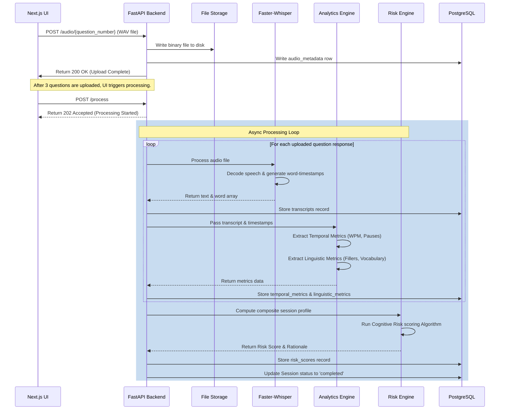

# System Design Specification

This document details the internal processing logic of the Cognitive Voice Intelligence Platform. It covers audio preprocessing, Whisper transcription, metrics extraction formulas, and the risk classification scoring algorithm.

---

## 🎙️ Speech Processing & Ingestion Pipeline

When a user submits an audio recording for a question, it flows through a sequential pipeline before metrics are written to the database.

---

## ⚡ Speech-to-Text Pipeline (ASR)

### Audio Standardization
For high transcription accuracy, the backend enforces standard audio metrics. Audio recorded via the browser is transcoded using standard audio container constraints:
*   **Format**: Mono WAV (PCM 16-bit)
*   **Sample Rate**: 16,000 Hz (native frequency for Whisper models)
*   **Preprocessing**: If a user uploads standard `.webm` audio, the backend automatically converts the container using `ffmpeg-python` wrappers to raw PCM 16-bit WAV.

### Faster-Whisper Integration
We use `faster-whisper` because it is up to 4x faster than the standard OpenAI PyTorch implementation due to CTranslate2 model quantization:
1.  **VAD (Voice Activity Detection)**: Before transcribing, Whisper uses Silero VAD to segment the audio, stripping leading and trailing silences to optimize decoder performance.
2.  **Word-Level Timestamps**: Enforced using the parameter `word_timestamps=True`. This maps the exact start and end times of every spoken word, which is critical for pause detection.

---

## 📊 Analytics Engine Formulas & Calculations

### 1. Temporal Metrics

*   **Total Speech Duration ($D_{total}$)**:
    Total recorded length of the audio file in seconds.
*   **Active Speech Duration ($D_{speech}$)**:
    The sum of all word durations. For a set of transcribed words $w_1, w_2, ..., w_N$ with start times $S_i$ and end times $E_i$:
    $$D_{speech} = \sum_{i=1}^{N} (E_i - S_i)$$
*   **Words Per Minute (WPM)**:
    Calculates the speed of verbal output:
    $$\text{WPM} = \frac{N}{D_{total} / 60}$$
*   **Pause Detection**:
    A pause is defined as any period of silence between consecutive words $w_i$ and $w_{i+1}$ that exceeds $250\text{ ms}$:
    $$\text{Pause gap} = S_{i+1} - E_i > 0.250\text{ seconds}$$
    The engine counts these events (`pause_count`) and finds the maximum pause value (`longest_pause_seconds`):
    $$P_{longest} = \max (S_{i+1} - E_i)$$

---

### 2. Linguistic Metrics

*   **Vocabulary Diversity (Lexical Density)**:
    Measures the ratio of content words (nouns, verbs, adjectives, adverbs) to total words. The system uses a basic Part-of-Speech (POS) helper dictionary to identify functional grammar words (pronouns, prepositions, conjunctions) and subtracts them.
*   **Repetition Index**:
    Calculates word redundancies. Let $C(w)$ be the count of word $w$ in the response transcript:
    $$\text{Repetition Index} = \frac{\sum_{w} (C(w) - 1)}{N}$$
*   **Filler Word Detection**:
    Compares lowercase words against a localized dictionary of common English filler words and pauses:
    $$\text{Filler Dictionary} = \{\text{"um"}, \text{"uh"}, \text{"ah"}, \text{"er"}, \text{"like"}, \text{"well"}, \text{"so"}\}$$
    We calculate the **Filler Word Ratio**:
    $$\text{Filler Ratio} = \frac{\text{Count of Filler Words}}{N}$$

---

## 🧠 Cognitive Risk Scoring Engine

The Risk Engine aggregates the temporal and linguistic measurements from the three answers and projects them onto an index from `0.0` (optimal) to `1.0` (high indicator of cognitive variation/risk).

### Normalized Score Calculations
Individual features are normalized relative to healthy populations (determined by configurable thresholds in `app/core/config.py`):
1.  **Tempo Score ($S_{tempo}$)**: Degrades if WPM falls below a lower boundary (e.g., < 90 WPM) or spikes indicating hyper-fluent speech.
2.  **Pause Penalty ($S_{pause}$)**: Scales up if the count of pauses is high or if the longest pause exceeds 3 seconds.
3.  **Linguistic Score ($S_{ling}$)**: Increases if the repetition index or filler word ratio is high.

### Mathematical Weighting Formulation
The final Risk Score is computed as a weighted average of normalized metric components:
$$\text{Risk Score} = (W_{tempo} \cdot S_{tempo}) + (W_{pause} \cdot S_{pause}) + (W_{ling} \cdot S_{ling})$$

*Where default weights are set to:*
*   $W_{tempo} = 0.30$
*   $W_{pause} = 0.40$
*   $W_{ling} = 0.30$

### Risk Classifications

| Score Range | Classification | Clinical Rationale Description |
| :--- | :--- | :--- |
| **0.00 – 0.35** | **Low Risk** | Speech metrics are well within the standard reference baseline. Fluent transition and structural coherence are observed. |
| **0.36 – 0.70** | **Medium Risk** | Mild variance is present. Indicated by elevated pause frequency, slow response pacing, or excessive filler word usage. Recommend follow-up evaluation. |
| **0.71 – 1.00** | **High Risk** | Significant variance from baseline standards. Marked by prolonged blocks of silence, highly repeated vocabulary clusters, and low verbal speed. |
